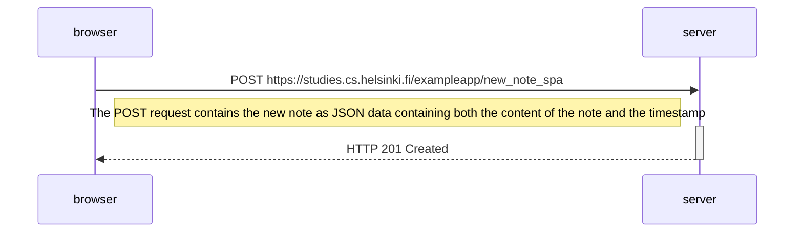

# sequence diagram

```mermaid
sequenceDiagram
    participant browser
    participant server

    browser->>server: POST https://studies.cs.helsinki.fi/exampleapp/new_note_spa
    Note right of browser: The POST request contains the new note as JSON data containing both the content of the note and the timestamp
    activate server
    server-->>browser: HTTP 201 Created
    deactivate server

    
```
